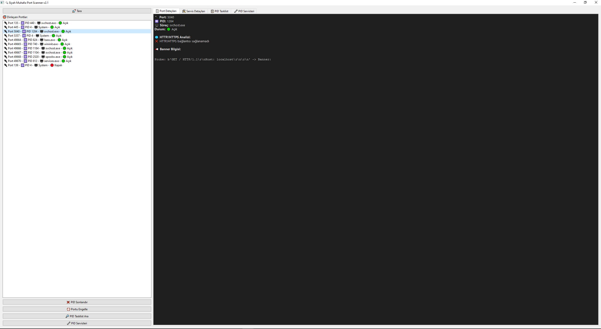
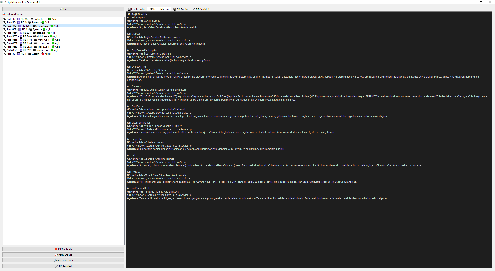
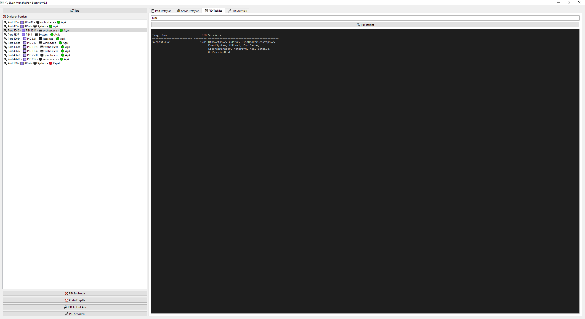
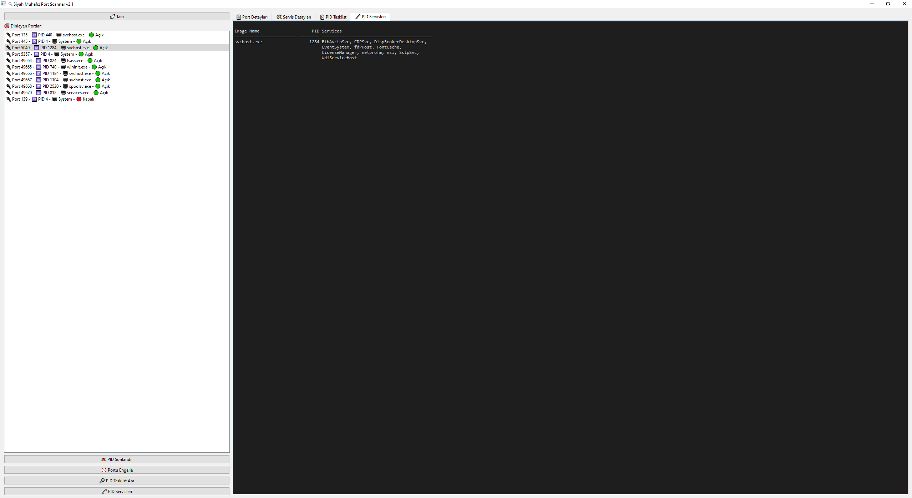

# 🔍 Siyah Muhafız Port Scanner v2.1

---

## 📌 Proje Hakkında

Siyah Muhafız Port Scanner, Windows ortamında çalışan, dinleyen portları ve ilgili süreçleri detaylıca analiz eden, yönetici haklarıyla çalışan güçlü bir port tarayıcıdır.  
Portların durumunu kontrol eder, PID'leri listeler, ilgili servis bilgilerini gösterir, HTTP/HTTPS servislerini analiz eder ve banner bilgilerini çeker.  
Ayrıca süreçleri sonlandırma ve belirli portları Windows güvenlik duvarı üzerinden engelleme özellikleri içerir.
---

📸 Ekran Görüntüsü






---
---

## 🚀 Özellikler

- 🎧 Dinleyen TCP portlarını ve ilgili PID’leri tespit eder.
- 🖥️ PID bazında süreç ve servis bilgilerini detaylı gösterir.
- 🌐 HTTP/HTTPS bağlantı durumlarını analiz eder.
- 📢 Port bazında banner grab ile servis bilgisi alır.
- ❌ Seçilen PID’yi sonlandırma.
- 🚫 Belirli portları Windows Güvenlik Duvarı ile engelleme.
- 📋 PID için detaylı `tasklist` ve servis bilgisi arama.
- 💻 Modern PyQt6 GUI ile kolay kullanım.
- ⚡ Yöneticilik gerektirir ve otomatik yükseltme yapar.

---

## 💾 Kurulum

1. Python 3.8+ yüklü olmalı.  
2. Gerekli kütüphaneleri yükleyin:

```
pip install PyQt6 requests
```

3. Script'i çalıştırın:

```
python port_scanner.py
```

---

## 🖥️ Kullanım

- **🚀 Tara** butonuna basarak port taramasını başlatın.
- Sol taraftaki listeden port seçin.
- Sağ tarafta port detayları, servis detayları ve PID’ye ait servisler sekmelerinden bilgi alın.
- PID veya port üzerinde işlem yapmak için ilgili butonları kullanabilirsiniz:
  - **❌ PID Sonlandır**
  - **🚫 Portu Engelle**
  - **🔎 PID Tasklist Ara**
  - **🔧 PID Servisleri**

---

## 📢 Lisans

Bu proje MIT Lisansı ile lisanslanmıştır.  
İstediğiniz gibi kullanabilir, değiştirebilir ve paylaşabilirsiniz.

---

## ✍️ İletişim

Geliştirici: Ebubekir Bastama  
GitHub: https://github.com/ebubekirbastama/ 

---

## 🎯 Notlar

- Proje sadece Windows işletim sistemi için tasarlanmıştır.
- Yönetici (admin) hakları gerektirir.
- Güvenlik duvarı kuralı ekleme ve işlem sonlandırma işlemleri dikkatli kullanılmalıdır.

---

🛡️ **Ebubekir Bastama** ile güvenli kalın!
